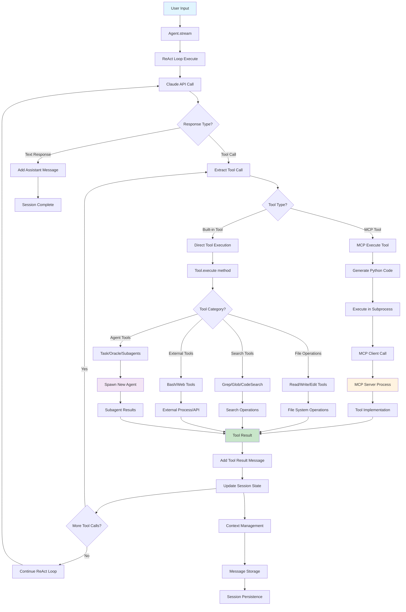

# codesm

An AI coding agent built with Python + Rust. Features a TUI interface, multi-provider support (Anthropic, OpenAI, OpenRouter), and a powerful tool system for reading, writing, and executing code.

> Still in early development. Contributions welcome!


## Mermaid Graph



## Quick Start

```bash
# Install
uv pip install -e .

# Run
codesm

# Or with uv directly
uv run codesm
```

## Agent Modes

codesm supports two agent modes for different task types:

### Smart Mode (Default)
- Uses powerful models (Claude Sonnet 4, GPT-4o)
- Best for complex tasks, architecture decisions, debugging
- Full capability, thorough reasoning

### Rush Mode
- Uses fast models (Claude Haiku 3.5, GPT-4o-mini)
- **67% cheaper, 50% faster**
- Best for simple, well-defined tasks: quick edits, small fixes, simple features

**Switch modes:**
- Press `tab` to toggle between modes
- Use `/rush` or `/smart` commands
- Use `/mode` to open mode selector

## Providers

### Supported Providers
- **Anthropic** - Claude models (Sonnet, Opus, Haiku)
- **OpenAI** - GPT-4o, GPT-4-turbo, o1
- **OpenRouter** - Access 100+ models with one API key
- **Google** - Gemini models (coming soon)

### Connect a Provider
1. Press `Ctrl+A` or use `/connect` command
2. Select provider
3. Enter API key

## Feature Progress

### Implemented

- [x] TUI interface (Textual-based)
- [x] Session management & persistence
- [x] Multi-provider support (Anthropic, OpenAI, OpenRouter)
- [x] **Rush Mode** - Fast/cheap mode for simple tasks
- [x] Agent loop with tool execution
- [x] Command palette (`Ctrl+P` or `/`)
- [x] Sidebar with session list
- [x] **Tools**: Read, Write, Edit, Bash, Glob, Grep, WebSearch, WebFetch, Diagnostics, CodeSearch, Todo, Ls, Batch

### To Be Implemented

#### Core Features (from opencode)
- [X] LSP integration
- [x] Code search (semantic search)
- [x] Multi-edit (batch file edits)
- [x] Patch tool
- [x] Task/sub-agent spawning
- [x] Todo tracking for agent
- [x] MCP (Model Context Protocol) support
- [x] Skill/plugin system
- [x] Snapshot/undo system
- [ ] Permission system
- [ ] Web search tool improvements
- [ ] Rust core performance
- [X] Web Search

#### Smart Multi-Model Architecture

The system uses task-specialized models across three tiers:

**Tier 1: Agent Modes** (Primary interaction)
- [x] **Smart Mode** - Claude Sonnet 4 / GPT-4o for complex reasoning
- [x] **Rush Mode** - Claude Haiku 3.5 / GPT-4o-mini for fast, cheap tasks
- [x] Mode switching via `tab` key or `/mode` command

**Tier 2: Feature Models** (Low-latency UI/UX tasks)
- [x] **Tab Completion** - Custom fine-tuned model for autocomplete/next-action
- [x] **Code Review** - Gemini 2.5 Pro (via OpenRouter) for bug detection and review assistance
- [x] **Titling** - Claude 3.5 Haiku (via OpenRouter) for fast thread title generation
- [x] **Look At** - Gemini 2.0 Flash (via OpenRouter) for image/PDF/media analysis

**Tier 3: Specialized Subagents** (Background processing)
- [x] **Oracle** - GPT-5/o1 for complex reasoning, planning, debugging
- [x] **Finder/Search** - Gemini 2.5 Flash for high-speed codebase retrieval
- [x] **Librarian** - Claude Sonnet 4 for multi-repo research & external code

**Workflow Management**
- [x] **Handoff System** - Gemini 2.5 Flash for context analysis & task continuation
- [x] **Topics/Indexing** - Gemini 2.0 Flash-Lite for thread categorization
- [x] **Task Router** - Route tasks based on reasoning depth vs speed tradeoff

**Infrastructure**
- [x] Multi-provider model registry (Anthropic, OpenAI, OpenRouter, Google)
- [x] Model selection logic per task type
- [x] Subagent spawning and orchestration
- [x] Context passing between agents
- [x] Cost/latency optimization layer

#### Other Smart Features
- [x] Mermaid diagram generation
- [x] Thread search & cross-thread context
- [ ] Auto todo planning & tracking during tasks
- [x] File citations with clickable links
- [x] Web page reading (WebFetch tool)
- [x] Parallel tool execution optimization

## Roadmap: Competitive Feature

### Critical (To match Amp/Claude Code/OpenCode)

#### Agent Architecture
- [ ] **Parallel Subagent Spawning** - Run multiple subagents concurrently for independent tasks
- [ ] **Context Window Management** - Smart context compression, summarization, and handoff
- [ ] **Automatic Thread Handoff** - When context gets long, seamlessly continue in new thread
- [ ] **Task Decomposition Engine** - Break complex tasks into parallelizable subtasks
- [ ] **Agent Self-Correction** - Detect and retry failed tool calls with different approaches

#### Tool System
- [x] **Undo/Redo System** - Revert any file edit with full history
- [x] **File Watcher** - React to file changes in real-time
- [x] **Diff Preview** - Show unified diff before applying edits
- [x] **Format on Save** - Auto-format files after edits (ruff, prettier, gofmt, rustfmt)
- [x] **Multi-file Atomic Edits** - Transactional edits across files

#### Context & Memory
- [ ] **AGENTS.md Support** - Read project-specific instructions automatically
- [ ] **Cross-Session Memory** - Remember user preferences and past solutions
- [ ] **Codebase Indexing** - Pre-index repos for instant semantic search
- [ ] **Git Integration** - Auto-commit, branch management, PR creation
- [ ] **Conversation Branching** - Fork conversations to explore alternatives

### Important (Competitive Advantages)

#### Intelligence Layer
- [x] **Code Review Agent** - Automatic PR review with actionable feedback
- [x] **Test Generation** - Auto-generate tests for new/changed code
- [x] **Bug Localization** - Given an error, find the root cause automatically
- [ ] **Refactoring Suggestions** - Proactive code improvement recommendations

#### Developer Experience
- [ ] **Streaming Tool Output** - Real-time output for long-running tools (tests, builds)
- [ ] **Progress Indicators** - Show what the agent is doing at each step
- [ ] **Keyboard-First Navigation** - Vim-style motions throughout TUI
- [ ] **Split Pane View** - Code preview alongside chat
- [ ] **File Tree Browser** - Navigate and select files visually
- [ ] **Syntax Highlighted Diffs** - Beautiful, readable code changes

#### Safety & Permissions
- [ ] **Sandboxed Execution** - Run bash commands in isolated environment
- [ ] **Permission Prompts** - Ask before destructive operations
- [ ] **Allowlist/Blocklist** - Configure which commands/paths are allowed
- [ ] **Audit Log** - Track all agent actions for review
- [ ] **Dry Run Mode** - Preview all changes without applying

### Nice to Have (Killer Features)

#### Advanced Capabilities
- [ ] **Mermaid Diagram Generation** - Auto-generate architecture/flow diagrams
- [ ] **Image/Screenshot Analysis** - Describe UI, extract text from images
- [ ] **PDF/Document Reading** - Extract and summarize document contents
- [ ] **Browser Automation** - Navigate and interact with web pages
- [ ] **API Testing** - Make HTTP requests and validate responses

#### Local-First Features
- [ ] **Ollama Integration** - Run fully local with open models
- [ ] **Embedding Cache** - Local vector DB for semantic search (ChromaDB/LanceDB)
- [ ] **Offline Fallback** - Graceful degradation when no internet
- [ ] **Model Switching Mid-Task** - Hot-swap models during execution
- [ ] **Cost Tracking Dashboard** - Monitor API spend in real-time

#### Collaboration
- [ ] **Session Sharing** - Share conversations via URL
- [ ] **Team Workspaces** - Shared sessions, shared memory
- [ ] **Real-time Collaboration** - Multiple users in same session
- [ ] **Export Formats** - Export to Markdown, JSON, or executable scripts

#### IDE Integration
- [ ] **VS Code Extension** - Native integration with file syncing
- [ ] **Neovim Plugin** - Lua-based plugin for Neovim users  
- [ ] **JetBrains Plugin** - Support for IntelliJ-based IDEs
- [ ] **Language Server** - Act as an LSP for AI-powered completions

#### Voice & Accessibility
- [ ] **Voice Input** - Whisper-based speech-to-text
- [ ] **Voice Output** - TTS for responses (optional)
- [ ] **Screen Reader Support** - Full accessibility compliance
- [ ] **High Contrast Themes** - Accessibility-focused UI themes

### Experimental (Moonshots)

- [ ] **Self-Improving Agent** - Learn from user corrections
- [ ] **Codebase-Specific Fine-tuning** - LoRA adapters for your repos
- [ ] **Multi-Agent Debates** - Multiple agents argue to find best solution
- [ ] **Autonomous Mode** - Run overnight, wake user for decisions
- [ ] **Plugin Marketplace** - Community-built skills and extensions
- [ ] **Natural Language Git** - "Undo my last 3 commits" → executes git commands
- [ ] **Code Generation Streaming** - Token-by-token code preview as it's written
- [ ] **Predictive Actions** - Suggest next action before user asks

---

## How to Make codesm Better

### vs Claude Code
- **Open source & extensible** - Full transparency, community-driven
- **Multi-provider** - Not locked to Anthropic; use any LLM
- **Rust core** - Performance-critical ops in Rust (grep, file ops)
- **Self-hostable** - No cloud dependency, run fully local
- **Custom skills** - User-defined agent behaviors

### vs Opencode
- **Python ecosystem** - Easier contribution, rich ML/AI libraries
- **Simpler architecture** - Less overhead, faster iteration
- **Better defaults** - Opinionated but sensible out-of-box experience

### Unique Differentiators to Build
1. **Hybrid Python+Rust** - Python for flexibility, Rust for speed
2. **Local-first AI** - First-class support for Ollama, llama.cpp
3. **Agent memory** - Long-term context across sessions
4. **Code understanding graphs** - AST-based code intelligence
5. **Collaborative mode** - Multiple users, shared sessions
6. **Voice interface** - Speech-to-code capabilities
7. **Custom model fine-tuning** - Train on your codebase patterns
8. **Offline mode** - Full functionality without internet

## Keyboard Shortcuts

| Key | Action |
|-----|--------|
| `tab` | Toggle Smart/Rush mode |
| `Ctrl+P` | Command palette |
| `Ctrl+A` | Connect provider |
| `Ctrl+N` | New session |
| `Ctrl+T` | Toggle theme |
| `Ctrl+B` | Toggle sidebar |
| `Ctrl+C` | Quit |
| `Escape` | Cancel current operation |

## Commands

| Command | Description |
|---------|-------------|
| `/mode` | Open mode selector |
| `/rush` | Switch to Rush mode |
| `/smart` | Switch to Smart mode |
| `/models` | Select model |
| `/connect` | Connect a provider |
| `/session` | Browse sessions |
| `/new` | New session |
| `/theme` | Change theme |
| `/status` | Show current status |
| `/help` | Show help |

---

## Post-Development Roadmap

### Phase 1: Polish & Reliability (1-2 weeks)
**Goal: Make it daily-drivable**
- [x] **Undo/Redo system** - Critical for trust
- [ ] **Permission prompts** - Ask before destructive ops
- [ ] **AGENTS.md support** - Match Amp/Claude Code behavior
- [ ] **Streaming tool output** - Real-time feedback for bash/tests

### Phase 2: Differentiation (2-4 weeks)
**Goal: Create your unique angle**
- [ ] **Ollama/local models** - First-class offline support (big differentiator)
- [ ] **Cost tracking dashboard** - Show users their spend in real-time
- [ ] **Git integration** - Auto-commit, branch, PR creation
- [ ] **Cross-session memory** - Remember preferences/past solutions

### Phase 3: Community & Growth (4-8 weeks)
**Goal: Build traction**
- [ ] **Plugin marketplace/skills** - Let community extend
- [ ] **VS Code extension** - Meet devs where they are
- [ ] **Session sharing** - Viral loop for growth
- [ ] **Better docs + demo videos**

### Recommended Focus Order
1. **Undo system** → builds trust
2. **Ollama support** → unique selling point vs Cursor/Claude Code
3. **Cost tracking** → users love transparency
4. **Git integration** → makes it a complete workflow

> 💡 **Strategic Note:** Ship Ollama support early—"fully local AI coding agent" is a strong positioning no major player owns yet.