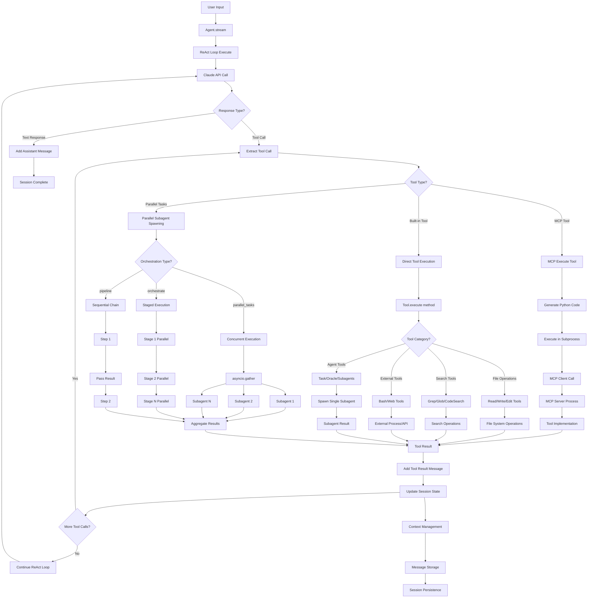

This document explains codesm's architecture for contributors and advanced users.

---

## High-Level Overview



---

## Agent System

### ReAct Loop

codesm uses a ReAct (Reason + Act) loop:

1. **Reason**: LLM analyzes the task
2. **Act**: Execute tools based on analysis
3. **Observe**: Process tool results
4. **Repeat**: Continue until task complete

```python
async def run_loop(self, message: str):
    while not self.is_complete:
        # Get LLM response
        response = await self.provider.generate(
            messages=self.messages,
            tools=self.tools,
        )
        
        # Process tool calls
        if response.tool_calls:
            results = await self.execute_tools(response.tool_calls)
            self.messages.append(results)
        
        # Check for completion
        if response.is_final:
            self.is_complete = True
```

### Sub-agents

The `task` tool spawns independent agents:

```python
async def spawn_subagent(self, task: str):
    subagent = Agent(
        model=self.config.subagent_model,
        tools=self.subagent_tools,
        max_steps=20,
    )
    return await subagent.run(task)
```

### Parallel Subagent Orchestration

codesm supports three orchestration patterns for running multiple subagents:

#### parallel_tasks
Run 2-10 independent tasks concurrently:

```python
from codesm.agent.orchestrator import spawn_parallel_subagents

results = await spawn_parallel_subagents(
    tasks=[
        ("researcher", "Find all API endpoints", "Find APIs"),
        ("researcher", "Analyze auth flow", "Analyze auth"),
        ("finder", "Find test files", "Find tests"),
    ],
    directory=Path("."),
    parent_tools=registry,
    max_concurrent=5,
)
```

#### orchestrate (Staged Execution)
Stages run sequentially, tasks within stages run in parallel:

```python
from codesm.agent.orchestrator import SubAgentOrchestrator, OrchestrationPlan

orchestrator = SubAgentOrchestrator(directory=Path("."), parent_tools=registry)
plan = OrchestrationPlan.staged([
    [  # Stage 1: Research (parallel)
        orchestrator.create_task("researcher", "Analyze current system", "Research"),
        orchestrator.create_task("finder", "Find related files", "Find files"),
    ],
    [  # Stage 2: Plan (after research)
        orchestrator.create_task("planner", "Create implementation plan", "Plan"),
    ],
    [  # Stage 3: Implement (after planning)
        orchestrator.create_task("coder", "Implement changes", "Implement"),
    ],
])
await orchestrator.execute_plan(plan)
```

#### pipeline (Sequential Chain)
Each step receives the previous step's output:

```python
# Uses {previous_result} template variable
steps = [
    {"subagent_type": "researcher", "prompt_template": "Find TODOs", "description": "Find"},
    {"subagent_type": "planner", "prompt_template": "Prioritize: {previous_result}", "description": "Prioritize"},
    {"subagent_type": "coder", "prompt_template": "Fix top TODO: {previous_result}", "description": "Fix"},
]
```

---

## Tool System

### Tool Interface

```python
class Tool(ABC):
    name: str
    description: str
    
    @abstractmethod
    def get_parameters_schema(self) -> dict:
        """Return JSON schema for parameters."""
        pass
    
    @abstractmethod
    async def execute(self, args: dict, context: dict) -> str:
        """Execute the tool and return result."""
        pass
```

### Tool Registration

```python
from codesm.tool.registry import ToolRegistry

registry = ToolRegistry()
registry.register(MyCustomTool())
```

---

## Storage

### File-Based Storage

Sessions are stored as JSON files:

```
~/.local/share/codesm/storage/
├── session/{project-id}/{session-id}.json
├── message/{session-id}/{message-id}.json
└── part/{message-id}/{part-id}.json
```

### Storage Operations

```python
from codesm.storage import Storage

# Read
session = await Storage.read(["session", project_id, session_id])

# Write
await Storage.write(["session", project_id, session_id], data)

# List
sessions = await Storage.list(["session", project_id])
```

---

## Configuration

### Config Loading Order

1. Default config (built-in)
2. User config (`~/.config/codesm/config.json`)
3. Project config (`./codesm.json`)
4. Environment variables
5. CLI arguments

Later sources override earlier ones.

---

## MCP Integration

### MCP Client

```python
from codesm.mcp import MCPManager

manager = MCPManager()
await manager.load_servers("mcp-servers.json")

# Get tool from MCP server
tool = manager.get_tool("github", "create_issue")
result = await tool.execute(args)
```

---

## Performance

### Optimizations

- Lazy tool loading
- Incremental context building
- Parallel tool execution
- Streaming responses

### Memory Management

- Context compaction for long sessions
- Message offloading to storage
- Garbage collection hooks
